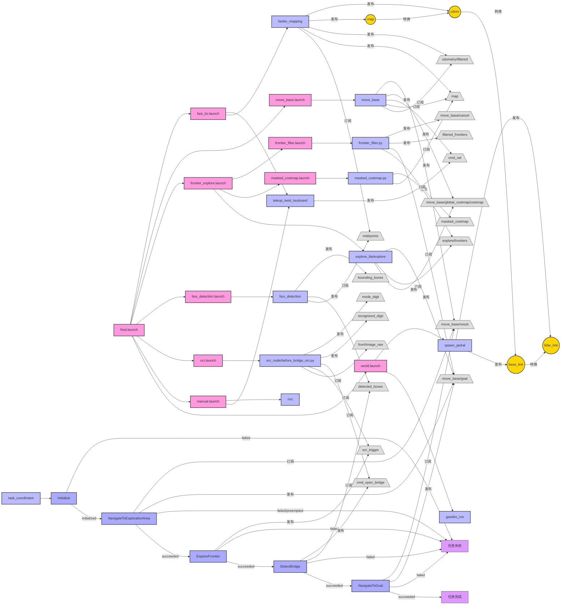

# ME5413 Final Project Group12
## Project Introduction

This is the final project of the ME5413 course that implements a robotic system with autonomous navigation, exploration, object detection and OCR capabilities. This system was developed based on ROS (Robot Operating System) and utilizes the Jackal robotics platform, which is capable of performing complex navigation tasks in a virtual environment.

## System Requirements

- Ubuntu 18.04/20.04
- ROS Melodic/Noetic
- Python 2.7/3.x
- Library Dependencies:
  - OpenCV
  - pytesseract
  - scikit-learn
  - numpy
  - smach

## Project structure

The project consists of the following modules.

- **fsm**: finite state machine module that coordinates the execution of individual tasks
- **ocr**: Optical character recognition module for recognizing numeric information in the environment.
- **box_detection**: Box detection module to detect and visualize boxes in the environment based on point cloud data.
- **frontier_explore**: Frontier exploration module for autonomous exploration of unknown regions.
- **navigation**: Navigation module, responsible for robot path planning and obstacle avoidance.
- **SLAM**: Synchronized localization and map construction using FAST-LIO.

## Installation steps

1. Create a ROS workspace:
```bash
mkdir -p ~/catkin_ws/src
cd ~/catkin_ws/src
```

2. Cloning Project:
```bash
git clone https://github.com/CANLAN-SC/ME5413_Final_Project_Group12.git
```

3. Installation dependencies:
```bash
sudo apt-get update
sudo apt-get install python-opencv python-numpy ros-$ROS_DISTRO-teleop-twist-keyboard ros-$ROS_DISTRO-gmapping ros-$ROS_DISTRO-move-base
sudo apt-get install tesseract-ocr libtesseract-dev
pip install pytesseract scikit-learn
```

4. Compilation workspace:
```bash
cd ~/catkin_ws
catkin_make
source devel/setup.bash
```

## operating method

### 1. Start all nodes
```bash
roslaunch fsm final.launch
```
Terminals should be seen to repeat
```bash
[DEBUG] [1743423288.122009188, 605.893000000]: Getting status over the wire.
```
At this time, the simulation environment, rviz, visual recognition, radar detection, navigation, SLAM nodes are activated and can be controlled by the keyboard to simulate the car.

> **Note:** If you encounter `/usr/bin/env: 'python\r': No such file or directory` error, please install and fix it with dos2unix:
> ```bash
> sudo apt-get install dos2unix
> dos2unix src/ocr/scripts/before_bridge_ocr.py
> dos2unix src/ocr/scripts/after_bridge_ocr.py
> ```

### 2. Adding a state machine

Newly opened terminals
```bash
cd ME5413_Final_Project_Group12
source devel/setup.bash
python src/fsm/scripts/fsm.py
```

Should see:
```bash
[INFO] [1743423111.980278, 0.000000]: State machine starting in initial state 'INITIALIZE' with userdata: 
        []
[INFO] [1743423111.982093, 0.000000]: Initializing system...
[INFO] [1743423111.983973, 0.000000]: State machine transitioning 'INITIALIZE':'initialized'-->'NAVIGATE_TO_GOAL'
[INFO] [1743423111.985405, 0.000000]: Mission three...
[INFO] [1743423111.987305, 0.000000]: State machine transitioning 'NAVIGATE_TO_GOAL':'succeeded'-->'TASK_ONE'
[INFO] [1743423111.988715, 0.000000]: Mission one...
[INFO] [1743423111.990916, 0.000000]: Trigger Message Posted
[INFO] [1743423127.133987, 562.406000]: State machine transitioning 'TASK_ONE':'succeeded'-->'TASK_TWO'
[INFO] [1743423127.136749, 562.406000]: Mission two...
[INFO] [1743423127.139615, 562.408000]: State machine transitioning 'TASK_TWO':'succeeded'-->'TASK_THREE'
[INFO] [1743423127.142591, 562.411000]: Mission three...
[INFO] [1743423127.144614, 562.412000]: State machine terminating 'TASK_THREE':'succeeded':'mission_completed'
[INFO] [1743423127.147272, 562.414000]: State machine execution completed, result: mission_completed
```

## Functional Description

- **State Machine Control**: Coordinates the order of execution of tasks such as navigation, exploration, and detection.
- **Autonomous exploration**: explore unknown areas using frontier_explore
- **Box detection**: detects boxes in the environment using the DBSCAN clustering algorithm.
- **OCR Recognition**: use Tesseract-OCR to recognize numbers in the environment for bridge unlocking
- **SLAM**: Use FAST-LIO for environment mapping and localization
- **Autonomous Navigation**: using move_base for autonomous robot navigation.

## System Architecture

The system consists of several modules, mainly including.

1. **Main startup file**: final.launch
2. **Sensor processing**: fast_lio for laser SLAM
3. **Target detection**: box_detection for box detection, ocr for character recognition
4. **Path planning**: move_base and TEB planner
5. **frontier_explore**: frontier_explore to realize unknown region exploration
6. **task coordination**: fsm state machine to coordinate the execution of each task


## Troubleshooting
### Where do the target position box coordinates come from?

These box coordinates are derived by looking at the formula in the code. The calculations are shown below:

#### Key calculations in the source code

There is code like this in the `spawnRandomBoxes()` function (lines 197-202):

```cpp
const double spacing = (MAX_X_COORD - MIN_X_COORD)/(box_labels.size() + 1);
for (int i = 0; i < box_labels.size(); i++)
{
  const ignition::math::Vector3d point = ignition::math::Vector3d(spacing*(i + 1) + MIN_X_COORD, 0.0, Z_COORD);
  // 后续代码...
}
```

#### Constant values used 

The following constants are defined at the top of the file:
- `NUM_BOX_TYPES = 4` (indicates the use of 4 different types of boxes)
- `MIN_X_COORD = 2.0`
- `MAX_X_COORD = 22.0`
- `Z_COORD = 3.0`

#### Calculation procedure

1. first the number of box types is taken as `NUM_BOX_TYPES = 4` (the result of cropping the `box_labels` vector in lines 96-97)
2. calculate the spacing: `spacing = (MAX_X_COORD - MIN_X_COORD)/(box_labels.size() + 1)`
   - `spacing = (22.0 - 2.0)/(4 + 1) = 20.0/5 = 4.0`. 3.
3. Then calculate the position of each box: `point_x = spacing*(i + 1) + MIN_X_COORD`.

For each of the 4 boxes:
- Box 1 (i=0): `4.0*(0+1) + 2.0 = 6.0`
- box 2 (i=1): `4.0*(1+1) + 2.0 = 10.0`
- Box 3 (i=2): `4.0*(2+1) + 2.0 = 14.0`
- Box 4 (i=3): `4.0*(3+1) + 2.0 = 18.0`
所有盒子的Y坐标都是0.0，Z坐标都是3.0。

### What is the law of generation of random boxes?
Analyze the provided `object_spawner_gz_plugin.cpp` code to get the generation law of random boxes in the explored region.

#### Box generation area and basic parameters

The area for box generation is defined as a rectangular area with the range:
- X coordinate range: 2.0 to 22.0 (MIN_X_COORD to MAX_X_COORD)
- Y coordinate range: 11.0 to 19.0 (MIN_Y_COORD to MAX_Y_COORD)
- Z coordinate fixed: 3.0 (Z_COORD)

#### Type and number of boxes

There are several key variables defined in the code to control the generation of boxes:

1. `NUM_BOX_TYPES = 4`: 4 different types of boxes will be generated
2. `box_labels` array: contains the possible box labels (numbers between 1 and 9)
3. `box_nums` array: defines the number of boxes of each type

#### Generation process

The generation process of the box is as follows:

1. **Randomization process**:
   - Randomly shuffle `box_labels` and `box_nums` using a randomization device
   - The first `NUM_BOX_TYPES` elements are selected as the final labels and quantities

2. **Random box generation**:
   - Generate random boxes according to the number of each type defined in the `box_nums` array
   - Box positions are randomly selected within a defined range
   - Generation ensures that there are no collisions between boxes (minimum distance of 1.2 units)

#### Key Rules

1. **Collision avoidance**: when a box is generated at a random location, the distance to the generated box is checked to ensure that it is separated by at least 1.2 units
   ```cpp
   for (const auto& pre_point : this->box_points)
   {
     const double dist = (point - pre_point).Length();
     if (dist <= 1.2)
     {
       has_collision = true;
       break;
     }
   }
   ```

2. **Labeling and quantity matching**:
   - Each label type generates a corresponding quantity of boxes in the exploration area
   - For example, if label [1,3,5,7] and quantity [2,1,3,1] are selected, then 2 boxes labeled 1 will be generated, 1 box labeled 3, and so on

3. **unique solution**:
   ``cpp
   // The comment in the code indicates that the quantity array should ensure that there is only one solution
   std::vector<int> box_nums = {1, 2, 3, 4, 5}; // can contain any positive number, but make sure there's only one solution
   ``

## Contributors

- Group 12 Members

## License

Detailed in the LICENSE file
