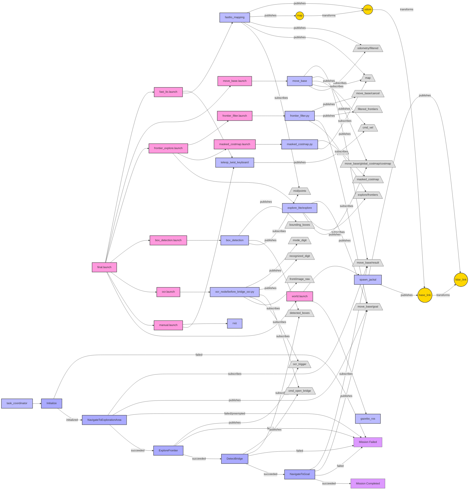

# ME5413 Final Project Group12

## Project Introduction

This is the final project for the ME5413 course, implementing a robotic system with autonomous navigation, exploration, object detection, and OCR capabilities. The system is developed based on ROS (Robot Operating System) using the Jackal robot platform, capable of completing complex navigation tasks in a virtual environment.

<video controls width="600">
  <source src="https://github.com/CANLAN-SC/ME5413_Final_Project_Group12/blob/zhihan/media/final.mp4" type="mp4">
</video>

## System Requirements

- Ubuntu 18.04/20.04
- ROS Melodic/Noetic
- Python 2.7/3.x
- Library Dependencies:
  - OpenCV
  - pytesseract
  - scikit-learn
  - numpy
  - smach

## Project Structure

The project mainly contains the following modules:

- **fsm**: Finite state machine module, coordinating the execution of various tasks
- **ocr**: Optical character recognition module, for recognizing numerical information in the environment
- **box_detection**: Box detection module, detecting and visualizing boxes in the environment based on point cloud data
- **frontier_explore**: Frontier exploration module, implementing autonomous exploration of unknown areas
- **navigation**: Navigation module, responsible for the robot's path planning and obstacle avoidance
- **SLAM**: Using FAST-LIO for simultaneous localization and mapping

## Installation Steps

1. Create a ROS workspace:
```bash
mkdir -p ~/catkin_ws/src
cd ~/catkin_ws/src
```

2. Clone the project:
```bash
git clone https://github.com/CANLAN-SC/ME5413_Final_Project_Group12.git
```

3. Install dependencies:
```bash
sudo apt-get update
sudo apt-get install python-opencv python-numpy tesseract-ocr libtesseract-dev
pip install pytesseract scikit-learn
sudo apt-get install ros-$ROS_DISTRO-smach ros-$ROS_DISTRO-smach-ros ros-$ROS_DISTRO-explore-lite ros-$ROS_DISTRO-teleop-twist-keyboard ros-$ROS_DISTRO-gmapping ros-$ROS_DISTRO-move-base ros-noetic-teb-local-planner ros-noetic-navigation
```

4. Build the workspace:
```bash
cd ~/catkin_ws
catkin_make
source devel/setup.bash
```

## Running Instructions

### 1. Launch all nodes

```bash
roslaunch fsm final.launch
```
You should see the terminal repeatedly showing:
```bash
[DEBUG] [1743423288.122009188, 605.893000000]: Getting status over the wire.
```
At this point, the simulation environment, rviz, visual recognition, lidar detection, navigation, and SLAM nodes are all launched and the simulated robot can be controlled via keyboard.

> **Note:** If you encounter the error `/usr/bin/env: 'python\r': No such file or directory`, please install and use dos2unix to fix it:
> ```bash
> sudo apt-get install dos2unix
> dos2unix src/ocr/scripts/before_bridge_ocr.py
> dos2unix src/ocr/scripts/after_bridge_ocr.py
> ```

### 2. **After exploration begins**, join the state machine

Open a new terminal:
```bash
cd ME5413_Final_Project_Group12
source devel/setup.bash
python src/fsm/scripts/fsm.py
```

You should see:
```bash
[INFO] [1744190511.107207, 545.144000]: Navigation client connected
[INFO] [1744190511.114783, 545.147000]: Navigation client connected
[INFO] [1744190511.129417, 545.163000]: State machine starting in initial state 'INITIALIZE' with userdata: 
	['costmap']
[INFO] [1744190511.130435, 545.164000]: State machine transitioning 'INITIALIZE':'initialized'-->'EXPLORE_FRONTIER'
[INFO] [1744190511.131264, 545.165000]: Starting frontier exploration task...
[INFO] [1744190511.132374, 545.165000]: Starting to monitor frontier point count, threshold is 0
[INFO] [1744190511.136510, 545.165000]: Map data ready, starting exploration...
```

## Feature Description

- **State Machine Control**: Coordinates the execution sequence of navigation, exploration, detection, and other tasks
- **Autonomous Exploration**: Uses frontier_explore to explore unknown areas
- **Box Detection**: Uses DBSCAN clustering algorithm to detect boxes in the environment
- **OCR Recognition**: Recognizes numbers in the environment, used for bridge unlocking
- **SLAM**: Uses FAST-LIO for environment mapping and localization
- **Autonomous Navigation**: Implements autonomous navigation using move_base

## System Architecture

The system consists of multiple modules, including:

1. **Main Launch File**: final.launch
2. **Sensor Processing**: fast_lio for laser SLAM
3. **Object Detection**: box_detection for detecting boxes, ocr for character recognition
4. **Path Planning**: move_base and TEB planner
5. **Frontier Exploration**: frontier_explore for exploring unknown areas
6. **Task Coordination**: fsm state machine for coordinating task execution



## Troubleshooting

### How are the target box coordinates determined?

These box coordinates are derived by examining the calculation formula in the code. The specific calculation process is as follows:

#### Key calculations in source code

In the `spawnRandomBoxes()` function, there is code like this (lines 197-202):

```cpp
const double spacing = (MAX_X_COORD - MIN_X_COORD)/(box_labels.size() + 1);
for (int i = 0; i < box_labels.size(); i++)
{
  const ignition::math::Vector3d point = ignition::math::Vector3d(spacing*(i + 1) + MIN_X_COORD, 0.0, Z_COORD);
  // subsequent code...
}
```

#### Constants used

The following constants are defined at the top of the file:
- `NUM_BOX_TYPES = 4` (indicating 4 different types of boxes are used)
- `MIN_X_COORD = 2.0`
- `MAX_X_COORD = 22.0`
- `Z_COORD = 3.0`

#### Calculation process

1. First, the number of box types is set to `NUM_BOX_TYPES = 4` (result of trimming the `box_labels` vector in lines 96-97)
2. Calculate spacing: `spacing = (MAX_X_COORD - MIN_X_COORD)/(box_labels.size() + 1)`
   - `spacing = (22.0 - 2.0)/(4 + 1) = 20.0/5 = 4.0`
3. Then calculate the position for each box: `point_x = spacing*(i + 1) + MIN_X_COORD`

For the 4 boxes, the positions are:
- Box 1 (i=0): `4.0*(0+1) + 2.0 = 6.0`
- Box 2 (i=1): `4.0*(1+1) + 2.0 = 10.0`
- Box 3 (i=2): `4.0*(2+1) + 2.0 = 14.0`
- Box 4 (i=3): `4.0*(3+1) + 2.0 = 18.0`

All boxes have Y coordinate 0.0 and Z coordinate 3.0.
Alternatively, coordinates can also be published in rviz using the mouse and listening to `/move_base_simple/goal`.

### What is the pattern for generating random boxes?

By analyzing the provided `object_spawner_gz_plugin.cpp` code, the pattern for generating random boxes in the exploration area can be determined.

#### Box generation range and basic parameters

The area for box generation is defined as a rectangular region with the range:
- X coordinate range: 2.0 to 22.0 (MIN_X_COORD to MAX_X_COORD)
- Y coordinate range: 11.0 to 19.0 (MIN_Y_COORD to MAX_Y_COORD)
- Fixed Z coordinate: 3.0 (Z_COORD)

#### Box types and quantities

The code defines several key variables to control box generation:

1. `NUM_BOX_TYPES = 4`: 4 different types of boxes will be generated
2. `box_labels` array: contains possible box labels (numbers between 1 and 9)
3. `box_nums` array: defines the quantity of each type of box

#### Generation process

The box generation process is as follows:

1. **Randomization**:
   - Random shuffling is applied to `box_labels` and `box_nums` 
   - The first `NUM_BOX_TYPES` elements are selected as the final labels and quantities

2. **Random box generation**:
   - Random boxes are generated according to the quantities defined in the `box_nums` array
   - Box positions are randomly selected within the defined range
   - Generation ensures boxes don't collide (minimum distance of 1.2 units)

#### Key rules

1. **Collision avoidance**: When generating boxes at random positions, the distance to already generated boxes is checked to ensure a minimum separation of 1.2 units
   ```cpp
   for (const auto& pre_point : this->box_points)
   {
     const double dist = (point - pre_point).Length();
     if (dist <= 1.2)
     {
       has_collision = true;
       break;
     }
   }
   ```

2. **Label and quantity matching**:
   - Each label type generates the corresponding number of boxes in the exploration area
   - For example, if labels [1,3,5,7] and quantities [2,1,3,1] are selected, then 2 boxes with label 1, 1 box with label 3, etc. will be generated

3. **Unique solution**:
   ```cpp
   // The comment in the code indicates that the quantity array should ensure only one solution
   std::vector<int> box_nums = {1, 2, 3, 4, 5}; // can contain any positive number, but make sure there's only one solution
   ```

## Contributors

- Group 12 members

## License

Detailed in the LICENSE file