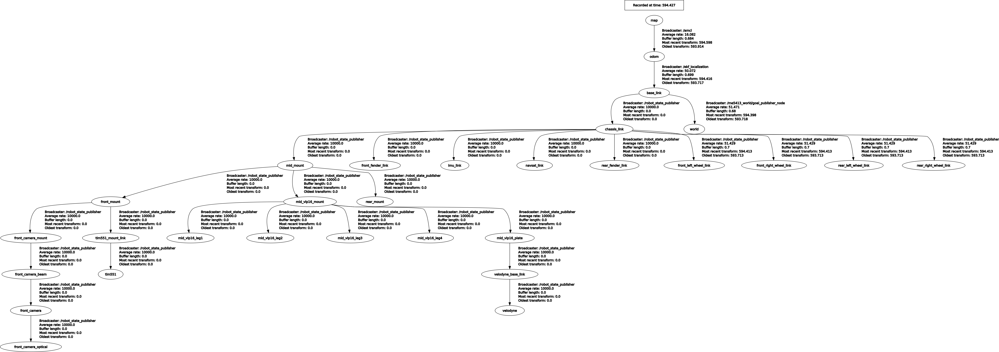

# ME5413 Final Project Group12

## Contributors

- [**Cao Zhihan**](https://github.com/dragonundertheworld) - *Project Coordination, State Machine Design and Object Detection* 
- [**Ni Haozhan**](https://github.com/nihaozhan) - *Frontier Exploration* 
- [**Sun Cheng**](https://github.com/CANLAN-SC) - *OCR Implementation*
- [**Wei Yangcheng**](https://github.com/Wei819cn) - *Navigation Implementation* 
- [**Wu Rui**](https://github.com/Avory1258) - *SLAM and Map Building* 
- [**Huang Xinchen**](https://github.com/koallaaa) - *SLAM and Map Building* 

## Project Introduction

This project presents the development of an autonomous mobile robotic system for the Jackal platform to perform complex navigation and task execution in a simulated Gazebo environment. The robot is required to map the environment, avoid obstacles, explore the randomly placed boxes, detect the number on the box, cross a dynamically generated bridge, unlock a timed blockade, and dock in front of the least frequently occurring box. We implemented a SLAM-based mapping module evaluated against ground truth, a sampling-based 2D localization module, a navigation module with global and local planner, a region-limited frontier exploration strategy, a real-time perception module and a general decision-making framework for robust task coordination. The integrated system demonstrates reliable performance and adaptability in dynamic scenarios.

## Demo


## System Requirements

- Ubuntu 20.04
- ROS Noetic
- Python 2.7/3.8
- Library Dependencies:
  - OpenCV
  - pytesseract
  - scikit-learn
  - numpy
  - smach

## Project Structure

The project mainly contains the following modules:

- **fsm**: Finite state machine module, coordinating the execution of various tasks
- **ocr**: Optical character recognition module, for recognizing numerical information in the environment
- **box_detection**: Box detection module, detecting and visualizing boxes in the environment based on point cloud data
- **frontier_explore**: Frontier exploration module, implementing autonomous exploration of unknown areas
- **navigation**: Navigation module, responsible for the robot's path planning and obstacle avoidance
- **SLAM**: Using FAST-LIO for simultaneous localization and mapping

## Installation Steps

1. Create a ROS workspace:
```bash
mkdir -p ~/catkin_ws/src
cd ~/catkin_ws/src
```

2. Clone the project:
```bash
git clone https://github.com/CANLAN-SC/ME5413_Final_Project_Group12.git
```

3. Install dependencies:
```bash
sudo apt-get update
sudo apt-get install python-opencv python-numpy tesseract-ocr libtesseract-dev
pip install pytesseract scikit-learn
sudo apt-get install ros-$ROS_DISTRO-smach ros-$ROS_DISTRO-smach-ros ros-$ROS_DISTRO-explore-lite ros-$ROS_DISTRO-teleop-twist-keyboard ros-$ROS_DISTRO-gmapping ros-$ROS_DISTRO-move-base ros-noetic-teb-local-planner ros-noetic-navigation
```

4. Build the workspace:
```bash
cd ~/catkin_ws
catkin_make
source devel/setup.bash
```

## Running Instructions

### 1. Launch all nodes

```bash
roslaunch fsm final.launch
```
You should see the terminal repeatedly showing:
```bash
[DEBUG] [1743423288.122009188, 605.893000000]: Getting status over the wire.
```
At this point, the simulation environment, rviz, visual recognition, lidar detection, navigation, and SLAM nodes are all launched and the simulated robot can be controlled via keyboard.

> **Note:** If you encounter the error `/usr/bin/env: 'python\r': No such file or directory`, please install and use dos2unix to fix it:
> ```bash
> sudo apt-get install dos2unix
> dos2unix src/ocr/scripts/before_bridge_ocr.py
> dos2unix src/ocr/scripts/after_bridge_ocr.py
> ```

### 2. **After exploration begins**, join the state machine

Open a new terminal:
```bash
cd ME5413_Final_Project_Group12
source devel/setup.bash
python src/fsm/scripts/fsm.py
```

You should see:
```bash
[INFO] [1744190511.107207, 545.144000]: Navigation client connected
[INFO] [1744190511.114783, 545.147000]: Navigation client connected
[INFO] [1744190511.129417, 545.163000]: State machine starting in initial state 'INITIALIZE' with userdata: 
	['costmap']
[INFO] [1744190511.130435, 545.164000]: State machine transitioning 'INITIALIZE':'initialized'-->'EXPLORE_FRONTIER'
[INFO] [1744190511.131264, 545.165000]: Starting frontier exploration task...
[INFO] [1744190511.132374, 545.165000]: Starting to monitor frontier point count, threshold is 0
[INFO] [1744190511.136510, 545.165000]: Map data ready, starting exploration...
```

## Feature Description

- **State Machine Control**: Coordinates the execution sequence of navigation, exploration, detection, and other tasks
- **Autonomous Exploration**: Uses frontier_explore to explore unknown areas
- **Box Detection**: Uses DBSCAN clustering algorithm to detect boxes in the environment
- **OCR Recognition**: Recognizes numbers in the environment, used for bridge unlocking
- **SLAM**: Uses FAST-LIO for environment mapping and localization
- **Autonomous Navigation**: Implements autonomous navigation using move_base

## System Architecture

```plaintext
.
├── docs -> Project documentation and references
├── media -> Images, videos, gifs and other media files
└── src
    ├── frontier_explore -> Autonomous exploration module for unknown areas
    │   ├── launch -> Launch files for frontier exploration
    │   └── scripts -> Python scripts for frontier exploration algorithms
    ├── fsm -> Finite State Machine for task coordination
    │   ├── launch -> Launch files for the state machine
    │   └── scripts -> Python scripts implementing the state machine logic
    ├── interactive_tools -> Tools for user interaction with the robot
    │   ├── include -> C++ header files for interactive tools
    │   ├── launch -> Launch files for interactive tools
    │   ├── resource -> Resource files for interactive tools
    │   ├── rviz -> RViz configuration files
    │   └── src -> C++ source files for interactive tools
    ├── jackal_description -> Robot description files for the Jackal platform
    │   ├── launch -> Launch files for the robot model
    │   ├── meshes -> 3D model files for visualization
    │   ├── scripts -> Helper scripts for the robot model
    │   └── urdf -> URDF robot description files
    ├── me5413_world -> Simulation world configuration
    │   ├── config -> Configuration files for the simulation
    │   ├── include -> C++ header files for world plugins
    │   ├── launch -> Launch files for the simulation world
    │   ├── media -> Media files specific to the simulation
    │   ├── models -> 3D models for simulation elements
    │   ├── rviz -> RViz configuration for world visualization
    │   ├── src -> C++ source files for world plugins
    │   └── worlds -> Gazebo world definition files
    ├── navigation -> Navigation and path planning module
    │   ├── launch -> Launch files for navigation
    │   ├── params -> Parameter files for navigation algorithms
    │   └── scripts -> Python scripts for navigation tasks
    ├── ocr -> Optical Character Recognition module
    │   ├── docs -> Documentation specific to OCR
    │   ├── launch -> Launch files for OCR nodes
    │   └── scripts -> Python scripts for OCR implementation
    ├── slam -> Simultaneous Localization and Mapping module
    │   ├── bagfiles -> ROS bag files for testing and replay
    │   ├── config -> Configuration files for SLAM algorithms
    │   ├── launch -> Launch files for SLAM
    │   ├── maps -> Generated and reference maps
    │   ├── rviz -> RViz configuration for map visualization
    │   └── scripts -> Python scripts for map processing
    └── third_party -> External dependencies and libraries
        ├── FAST_LIO -> Fast LiDAR-Inertial Odometry implementation
        ├── livox_ros_driver -> Driver for Livox LiDAR sensors
        └── pcd_to_map -> Tool for converting point clouds to maps
```


## Appendix
### ROS Graph


### TF Tree

