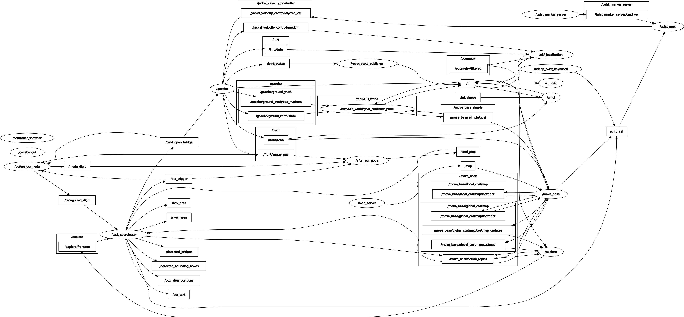
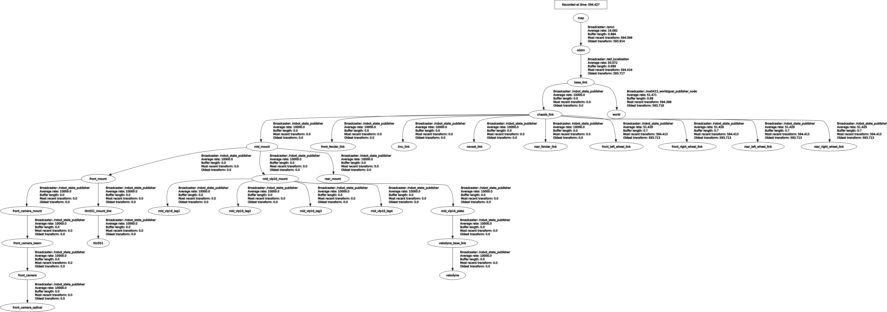

# ME5413 期末项目 第12组

## 贡献者

- [**曹知寒**](https://github.com/dragonundertheworld) - *项目协调、状态机设计与目标检测*  
- [**倪浩展**](https://github.com/nihaozhan) - *前沿探索*  
- [**孙成**](https://github.com/CANLAN-SC) - *OCR 实现*  
- [**魏阳成**](https://github.com/Wei819cn) - *导航实现*  
- [**吴蕊**](https://github.com/Avory1258) - *SLAM 与地图构建*  
- [**黄馨辰**](https://github.com/koallaaa) - *SLAM 与地图构建*  

## 项目简介

本项目开发了一个基于 Jackal 平台的自主移动机器人系统，用于在 Gazebo 模拟环境中执行复杂的导航和任务。机器人需要完成环境建图、避障、探索随机放置的箱子、识别箱子上的数字、跨越动态生成的桥梁、解锁限时障碍并停靠在出现频率最低的箱子前。我们实现了基于 SLAM 的建图模块（与真实数据对比评估）、基于采样的 2D 定位模块、带有全局和局部规划器的导航模块、区域限制的前沿探索策略、实时感知模块以及一个通用的决策框架，用于稳健的任务协调。集成系统在动态场景中表现出可靠性和适应性。

## 演示


## 系统要求

- Ubuntu 20.04
- ROS Noetic
- Python 2.7/3.8
- 库依赖：
  - OpenCV
  - pytesseract
  - scikit-learn
  - numpy
  - smach

## 项目结构

项目主要包含以下模块：

- **fsm**: 有限状态机模块，用于协调各种任务的执行
- **ocr**: 光学字符识别模块，用于识别环境中的数字信息
- **box_detection**: 箱子检测模块，基于点云数据检测并可视化环境中的箱子
- **frontier_explore**: 前沿探索模块，实现未知区域的自主探索
- **navigation**: 导航模块，负责机器人的路径规划和避障
- **SLAM**: 使用 FAST-LIO 实现同步定位与建图

## 安装步骤

1. 创建 ROS 工作空间：
```bash
mkdir -p ~/catkin_ws/src
cd ~/catkin_ws/src
```

2. 克隆项目：
```bash
git clone https://github.com/CANLAN-SC/ME5413_Final_Project_Group12.git
```

3. 安装依赖：
```bash
sudo apt-get update
sudo apt-get install python-opencv python-numpy tesseract-ocr libtesseract-dev
pip install pytesseract scikit-learn
sudo apt-get install ros-$ROS_DISTRO-smach ros-$ROS_DISTRO-smach-ros ros-$ROS_DISTRO-explore-lite ros-$ROS_DISTRO-teleop-twist-keyboard ros-$ROS_DISTRO-gmapping ros-$ROS_DISTRO-move-base ros-noetic-teb-local-planner ros-noetic-navigation
```

4. 编译工作空间：
```bash
cd ~/catkin_ws
catkin_make
source devel/setup.bash
```

## 运行说明

### 1. 启动所有节点

```bash
roslaunch fsm final.launch
```
你应该会在终端中反复看到以下内容：
```bash
[DEBUG] [1743423288.122009188, 605.893000000]: Getting status over the wire.
```
此时，仿真环境、rviz、视觉识别、激光雷达检测、导航和 SLAM 节点均已启动，模拟机器人可以通过键盘控制。

> **注意：** 如果遇到错误 `/usr/bin/env: 'python\r': No such file or directory`，请安装并使用 dos2unix 修复：
> ```bash
> sudo apt-get install dos2unix
> dos2unix src/ocr/scripts/before_bridge_ocr.py
> dos2unix src/ocr/scripts/after_bridge_ocr.py
> ```

### 2. **探索开始后**，加入状态机

打开一个新终端：
```bash
cd ME5413_Final_Project_Group12
source devel/setup.bash
python src/fsm/scripts/fsm.py
```

你应该会看到：
```bash
[INFO] [1744190511.107207, 545.144000]: Navigation client connected
[INFO] [1744190511.114783, 545.147000]: Navigation client connected
[INFO] [1744190511.129417, 545.163000]: State machine starting in initial state 'INITIALIZE' with userdata: 
    ['costmap']
[INFO] [1744190511.130435, 545.164000]: State machine transitioning 'INITIALIZE':'initialized'-->'EXPLORE_FRONTIER'
[INFO] [1744190511.131264, 545.165000]: Starting frontier exploration task...
[INFO] [1744190511.132374, 545.165000]: Starting to monitor frontier point count, threshold is 0
[INFO] [1744190511.136510, 545.165000]: Map data ready, starting exploration...
```

## 功能描述

- **状态机控制**: 协调导航、探索、检测等任务的执行顺序
- **自主探索**: 使用 frontier_explore 模块探索未知区域
- **箱子检测**: 使用 DBSCAN 聚类算法检测环境中的箱子
- **OCR 识别**: 识别环境中的数字，用于桥梁解锁
- **SLAM**: 使用 FAST-LIO 进行环境建图与定位
- **自主导航**: 使用 move_base 实现自主导航

## 系统架构

```plaintext
.
├── docs -> 项目文档与参考资料
├── media -> 图片、视频、GIF 和其他媒体文件
└── src
    ├── frontier_explore -> 未知区域的自主探索模块
    │   ├── launch -> 前沿探索的启动文件
    │   └── scripts -> 前沿探索算法的 Python 脚本
    ├── fsm -> 用于任务协调的有限状态机
    │   ├── launch -> 状态机的启动文件
    │   └── scripts -> 实现状态机逻辑的 Python 脚本
    ├── interactive_tools -> 用户与机器人交互的工具
    │   ├── include -> 交互工具的 C++ 头文件
    │   ├── launch -> 交互工具的启动文件
    │   ├── resource -> 交互工具的资源文件
    │   ├── rviz -> RViz 配置文件
    │   └── src -> 交互工具的 C++ 源文件
    ├── jackal_description -> Jackal 平台的机器人描述文件
    │   ├── launch -> 机器人模型的启动文件
    │   ├── meshes -> 用于可视化的 3D 模型文件
    │   ├── scripts -> 机器人模型的辅助脚本
    │   └── urdf -> URDF 机器人描述文件
    ├── me5413_world -> 仿真世界配置
    │   ├── config -> 仿真配置文件
    │   ├── include -> 世界插件的 C++ 头文件
    │   ├── launch -> 仿真世界的启动文件
    │   ├── media -> 仿真专用的媒体文件
    │   ├── models -> 仿真元素的 3D 模型
    │   ├── rviz -> 世界可视化的 RViz 配置
    │   ├── src -> 世界插件的 C++ 源文件
    │   └── worlds -> Gazebo 世界定义文件
    ├── navigation -> 导航与路径规划模块
    │   ├── launch -> 导航的启动文件
    │   ├── params -> 导航算法的参数文件
    │   └── scripts -> 导航任务的 Python 脚本
    ├── ocr -> 光学字符识别模块
    │   ├── docs -> OCR 专用文档
    │   ├── launch -> OCR 节点的启动文件
    │   └── scripts -> OCR 实现的 Python 脚本
    ├── slam -> 同步定位与建图模块
    │   ├── bagfiles -> 用于测试和回放的 ROS bag 文件
    │   ├── config -> SLAM 算法的配置文件
    │   ├── launch -> SLAM 的启动文件
    │   ├── maps -> 生成的地图与参考地图
    │   ├── rviz -> 地图可视化的 RViz 配置
    │   └── scripts -> 地图处理的 Python 脚本
    └── third_party -> 外部依赖与库
        ├── FAST_LIO -> Fastlio实现
        ├── livox_ros_driver -> Livox 激光雷达传感器驱动
        └── pcd_to_map -> 点云转地图工具
```

## 附录
### ROS Graph


### TF 树
