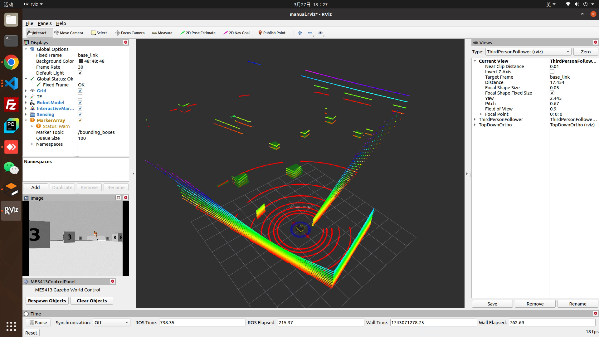

## Dependencies
```
pip install scikit-learn
```
## Run
Terminal 1:
```
cd ME5413_Final_Project_Group12
catkin_make
source devel/setup.bash
roslaunch me5413_world world.launch
```
Terminal 2:
```
source devel/setup.bash
roslaunch me5413_world manual.launch
```
Terminal 3:
```
source devel/setup.bash
roslaunch box_detection box_detection.launch
```
## Demo
<div>
   
</div>

## Further work
（1）当前效果展示只是使用了sensor的原始数据：\mid\points (数据类型：sensor_msgs/PointCloud2),后续需要Mapping组发布SLAM之后的3D点云数据(数据类型：sensor_msgs/PointCloud2)作为输入

（2）需要mapping组提供小车坐标系与map坐标系之间的tf变换关系

（3）需要mapping组提供盒子的区域范围（矩形框）

（4）最后调试时看检测结果考虑是否需要使用camera中的数据进行2D检测，之后再使用camera_calibration进行目标匹配

（5）需要mapping组结果发布之后综合调试decision making步骤如何调整